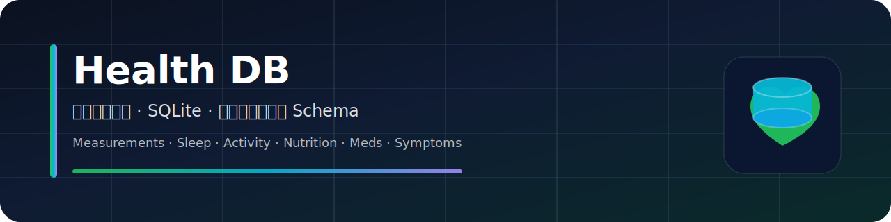

## Health-：个人健康数据 SQLite 数据库（可扩展）

你的 GitHub 仓库：[`sou350121/health-`](https://github.com/sou350121/health-)

### 目标
- **用 SQLite 打造一个本地优先**的健康数据仓库：体征（体重/心率/血压…）、睡眠、运动、饮食、用药、症状、疾病史等。
- 表结构尽量**稳定**：新增指标优先通过字典表 `measurement_type` 扩展，而不是频繁改表。

### 快速开始（Windows / PowerShell）
在项目根目录（`health-`）运行：

```powershell
.\scripts\init_db.ps1
```

默认会生成数据库文件：`.\data\health.db`（已在 `.gitignore` 中忽略）。

你也可以指定路径：

```powershell
.\scripts\init_db.ps1 -DbPath "D:\Project_dev\health-\data\health.db"
```

### 核心表（你最常用的）
- **`person` / `person_profile`**：一个人（可扩展为多用户/家庭账号）。
- **`measurement_type`**：指标字典（例如 `weight_kg`、`heart_rate_bpm`）。新增指标通常只要往这里插一行。
- **`measurement`**：时间序列指标数据（体征/实验室/步数/饮水等都可进这里）。
- **`activity_session` / `sleep_session`**：运动/睡眠会话（适合记录开始/结束/时长等结构化数据）。
- **`nutrition_intake` / `food_item`**：饮食摄入（既可手动记录，也可维护食物库）。
- **`medication` / `medication_intake`**：用药计划与实际服用记录。
- **`condition` / `symptom`**：疾病史与症状记录。

### 推荐的数据约定
- **时间**：统一用 UTC 的 ISO-8601 文本（示例：`2025-12-29T12:34:56.789Z`）。
- **单位**：优先在 `measurement_type.unit` 固定；单条数据特殊情况用 `measurement.unit` 覆盖。
- **来源**：设备/应用/手动/导入统一用 `source` 表标记。
- **updated_at**：当前 schema 为了兼容性未使用 trigger 自动更新；如需维护请在应用层 UPDATE 时同步写入。

### 如何新增一个新指标（示例）
例如你想加“静息心率”：

```sql
INSERT INTO measurement_type (code, display_name, category, unit, value_kind, min_num, max_num)
VALUES ('resting_hr_bpm', '静息心率', 'vital', 'bpm', 'number', 0, 250);
```

然后往 `measurement` 写数据即可（`type_id` 通过 `measurement_type.code` 查出来）。

### 示例查询
见 `docs/examples.sql`（包含插入样例、按天汇总、最近 7 天趋势等）。


